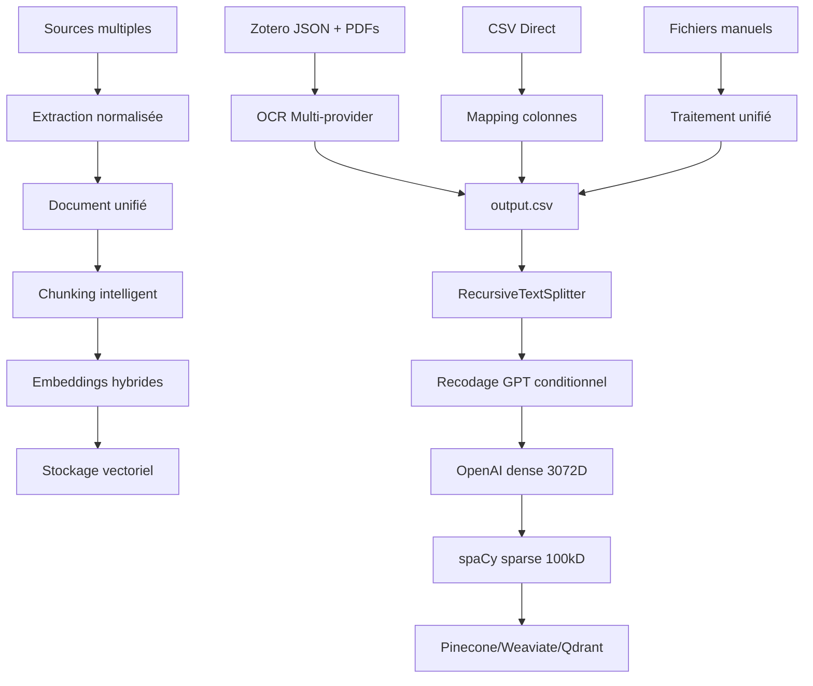

# Architecture actuelle du pipeline RAGpy

**Date de création** : 2025-10-21  
**Dernière mise à jour** : 2025-11-24 (Refactored app/main.py, Pinned Dependencies)  
**Objectif** : Documenter l'architecture existante complète avec analyse détaillée

---

## Vue d'ensemble du système

**RAGpy** est un pipeline sophistiqué de **Retrieval-Augmented Generation (RAG)** conçu pour traiter des documents académiques et les préparer pour le stockage dans des bases vectorielles. Le système combine une interface web moderne (FastAPI) avec un pipeline de traitement modulaire pour l'extraction, le chunking, l'embedding et l'insertion vectorielle.

```
┌─────────────────────────────────────────────────────────────────┐
│                 PIPELINE COMPLET RAGpy (2025-11-22)             │
└─────────────────────────────────────────────────────────────────┘

ARCHITECTURE MODULAIRE:
├── app/                  # Interface web FastAPI (point d'entrée)
│   ├── main.py          # Orchestrateur web (1,543 lignes)
│   ├── utils/           # Intégration Zotero
│   ├── static/          # Assets CSS, favicon
│   └── templates/       # Templates HTML (Jinja2)
├── scripts/             # Pipeline de traitement
│   ├── rad_dataframe.py # PDF/Zotero → CSV (OCR)
│   ├── rad_chunk.py     # Chunking + embeddings
│   └── rad_vectordb.py  # Insertion bases vectorielles
├── core/               # Modèles de données unifiés
│   └── document.py     # Classe Document abstraite
├── ingestion/          # Modules d'ingestion
│   └── csv_ingestion.py # Ingestion CSV directe
├── config/             # Configuration YAML
├── tests/              # Suite de tests
├── uploads/            # Sessions utilisateur
└── logs/              # Logs application

FLUX DE DONNÉES:
Input Sources → Data Extraction → Document Processing → Vector Storage
     ↓              ↓                    ↓                  ↓
├─ Zotero+PDFs    CSV Generation    Chunking/Embedding   Pinecone
├─ Direct CSV  →     output.csv  →    JSON stages    →   Weaviate
└─ Manual Files                                          Qdrant
```

---

## Analyse de l'architecture (2025-11-22)

### 🏗️ **Qualité du code et structure**

#### **Points forts identifiés**
- **Architecture modulaire excellente** avec séparation claire des responsabilités
- **Classe Document unifiée** garantissant la compatibilité pipeline
- **Logging structuré** avec rotation et niveaux appropriés
- **Gestion d'erreurs sophistiquée** avec mécanismes de retry
- **Support multi-providers** pour optimisation des coûts

#### **Points d'amélioration critiques**
- **app/main.py trop volumineux** (1,543 lignes) → refactorisation nécessaire
- **Validation d'entrée insuffisante** sur plusieurs endpoints
- **Dépendances non épinglées** → risques de sécurité
- **Conventions de nommage mixtes** (français/anglais)

#### **Dette technique majeure**
- **Dépendances non épinglées** : Risque de stabilité et de sécurité (voir `requirements.txt`).
- **Monolithe `app/main.py`** : Complexité de maintenance élevée.

### 🚀 **API et endpoints**

L'application FastAPI expose **16 endpoints principaux** couvrant l'intégralité du pipeline :

#### **Endpoints de traitement de fichiers**
- `POST /upload_zip` - Upload archives Zotero
- `POST /upload_csv` - Ingestion CSV directe 
- `POST /upload_stage_file/{stage}` - Artifacts intermédiaires

#### **Pipeline de traitement**
- `POST /process_dataframe` - Extraction PDF/OCR
- `POST /initial_text_chunking` - Génération chunks
- `POST /dense_embedding_generation` - Embeddings OpenAI
- `POST /sparse_embedding_generation` - Embeddings spaCy
- `POST /upload_db` - Insertion bases vectorielles

#### **Fonctionnalités avancées**
- **Server-Sent Events (SSE)** pour suivi temps réel
- **Gestion de sessions** avec répertoires uniques
- **Configuration dynamique** des credentials
- **Intégration Zotero** bidirectionnelle

#### **Sécurité actuelle**
```python
# Configuration CORS permissive (développement)
app.add_middleware(CORSMiddleware, allow_origins=["*"])
# Recommandation: Restreindre en production
```

### 🔄 **Pipeline de traitement des données**

#### **Flux de données end-to-end**



#### **Transformations de données critiques**

**1. Hiérarchie OCR avec fallback intelligent**
```python
# Ordre de priorité automatique
Mistral OCR (Markdown) → OpenAI Vision → PyMuPDF Legacy
     ↓                      ↓              ↓
   Skip recodage         Recodage GPT   Recodage lourd
   (économie 80%)       (coût standard) (coût maximum)
```

**2. Chunking adaptatif**
- **Tokens**: 1000 (overlap 150) pour `text-embedding-3-large`
- **Séparateurs**: `["\n\n", "#", "##", "\n", " ", ""]`
- **Recodage conditionnel**: Skip si `texteocr_provider="mistral"` ou `"csv"`

**3. Embeddings hybrides optimisés**
```python
# Dense: Similarité sémantique (OpenAI)
embedding_dense = client.embeddings.create(
    input=chunks, model="text-embedding-3-large"
)  # 3072 dimensions

# Sparse: Correspondance lexicale (spaCy français)
sparse_features = extract_sparse_features(text)  # TF normalisé
# Hash-based indexing: hash(lemma) % 100,000 → 100k dimensions
```

#### **Points d'intégration clés**

**Classe Document unifiée** (architecture solide):
```python
@dataclass
class Document:
    texteocr: str                    # Variable pivot unique
    meta: Dict[str, Any]            # Métadonnées extensibles
    
    def to_dict(self) -> Dict[str, Any]:
        return {"texteocr": self.texteocr, **self.meta}
```

**Gestion des providers OCR**:
```python
# Auto-détection et fallback
provider_hierarchy = ["mistral", "openai", "legacy"]
ocr_result = extract_text_with_ocr(pdf_path, return_details=True)
# → OCRResult(text, provider) pour traçabilité complète
```

### ⚙️ **Configuration et environnement**

#### **Gestion des variables d'environnement**

**Variables obligatoires**:
```bash
OPENAI_API_KEY=sk-...  # Embeddings + recodage
```

**Variables d'optimisation**:
```bash
# Réduction coûts (~75% économie)
OPENROUTER_API_KEY=sk-or-v1-...
OPENROUTER_DEFAULT_MODEL=openai/gemini-2.5-flash

# OCR premium
MISTRAL_API_KEY=...
MISTRAL_OCR_MODEL=mistral-ocr-latest
```

**Bases vectorielles** (au moins une requise):
```bash
# Pinecone
PINECONE_API_KEY=pcsk-...
PINECONE_ENV=https://your-index.svc.aped.pinecone.io

# Weaviate
WEAVIATE_URL=https://your-cluster.weaviate.network
WEAVIATE_API_KEY=...

# Qdrant  
QDRANT_URL=https://your-cluster.qdrant.tech
QDRANT_API_KEY=...
```

**Intégration Zotero** (recherche académique):
```bash
ZOTERO_API_KEY=...     # Génération notes automatiques
ZOTERO_USER_ID=...     # Auto-détecté depuis exports
ZOTERO_GROUP_ID=...    # Support bibliothèques de groupe
```

#### **Configuration CSV flexible**

```yaml
# config/csv_config.yaml
csv:
  text_column: "text"           # Colonne source → texteocr
  encoding: "auto"              # Détection chardet
  delimiter: ","
  meta_columns: []              # Si vide: toutes sauf text_column
  skip_empty: true              # Ignorer lignes vides
  add_row_index: true           # Métadonnées row_index
  source_type: "csv"            # Type pour Document
```

#### **Patterns de déploiement**

**Démarrage serveur**:
```bash
# Développement
uvicorn app.main:app --reload --host 0.0.0.0 --port 8000

# Production (via script CLI)
./ragpy_cli.sh start  # Gestion arrière-plan + logs
```

**Structure de sessions**:
```
uploads/
├── session_abc123/          # Session utilisateur unique
│   ├── uploaded_files/      # Archives/CSV uploadés
│   ├── output.csv          # Résultat extraction
│   ├── output_chunks.json  # Chunks initiaux
│   ├── output_chunks_with_embeddings.json      # + Embeddings denses
│   ├── output_chunks_with_embeddings_sparse.json  # + Embeddings sparses
│   └── *.log              # Logs spécifiques session
```

### 🔍 **Intégrations externes**

#### **Services LLM et OCR**
- **OpenAI**: Embeddings (`text-embedding-3-large`) + completion (`gpt-4o-mini`)
- **OpenRouter**: Alternative économique (75% moins cher)
- **Mistral**: OCR premium avec sortie Markdown
- **spaCy**: NLP français (`fr_core_news_md`) pour embeddings sparse

#### **Bases vectorielles supportées**
- **Pinecone**: Hybrid search (dense + sparse), namespaces
- **Weaviate**: Multi-tenant, hybrid search
- **Qdrant**: Vector similarity, local/cloud

#### **Recherche académique**
- **Zotero**: Extraction métadonnées + génération notes automatiques
- **Support PDF**: OCR multi-provider avec fallback
- **Export bidirectionnel**: Notes générées → bibliothèque Zotero

---

## Points critiques pour l'ingestion CSV

### 🎯 **Variable pivot unique: `texteocr`**

| Point de création/consommation | Fichier | Ligne | Status |
|-------------------------------|---------|-------|--------|
| **Création (OCR)** | rad_dataframe.py | 508 | ✅ Stable |
| **Création (CSV)** | csv_ingestion.py | 377 | ✅ Implémenté |
| **Consommation (chunking)** | rad_chunk.py | 199 | ✅ Unifié |

**Conclusion**: L'abstraction `texteocr` fonctionne parfaitement pour unifier toutes les sources d'ingestion.

### ✅ **Gestion des métadonnées (Résolu)**

| Emplacement | Fichier | Status |
|------------|---------|--------|
| Création chunks | rad_chunk.py | ✅ **Dynamique** (Injection de toutes les colonnes) |
| Pinecone | rad_vectordb.py | ✅ **Dynamique** (Injection de toutes les clés) |
| Weaviate | rad_vectordb.py | ✅ **Dynamique** (Injection de toutes les propriétés) |
| Qdrant | rad_vectordb.py | ✅ **Dynamique** (Injection dans payload) |

**Solution implémentée** :
```python
# rad_chunk.py : Injection dynamique
chunk_metadata = {
    "id": f"{doc_id}_{original_chunk_index}",
    "text": cleaned_text,
    # ... champs techniques
}
# Injecter toutes les métadonnées source
for key, value in row_data.items():
    if key not in ("texteocr", "text", "id", ...):
        chunk_metadata[key] = sanitize_metadata_value(value, "")
```

### ✅ **Optimisations de coût implémentées**

```python
# rad_chunk.py:232-237 - Logique de recodage intelligente
provider = str(row_data.get("texteocr_provider", "")).lower()
recode_required = provider not in ("mistral", "csv")  # ✅ CSV skip GPT

# Support OpenRouter (économie ~75%)
use_openrouter = "/" in model  # Auto-détection provider/model
```

**Résultat**: CSV et Mistral OCR évitent automatiquement le recodage GPT coûteux.

---

## Architecture des tests

### 📋 **Couverture de tests actuelle**

**Tests implémentés** (excellente qualité):
- ✅ **CSV ingestion pipeline** - 5 scénarios détaillés
- ✅ **Client Zotero** - Tests intégration API
- ✅ **Génération notes LLM** - Validation contenu
- [x] **Refactor `app/main.py`**
  - [x] Split into `app/routes/` modules (ingestion, processing, settings)
  - [x] Create `app/core/config.py` for constants
  - [x] Clean up imports and initialization
- [x] **Pin Dependencies**
  - [x] Update `scripts/requirements.txt` with specific versions
- [x] **Improve Testing**
  - [x] Add `tests/test_integration_api.py` for API endpoints
  - [ ] Run and validate tests (requires environment setup)
- ✅ **Classe Document** - Tests modèle de données
- ✅ **Configuration** - Chargement settings et prompts

**Lacunes identifiées**:
- ❌ **Application FastAPI** - Pas de tests intégration endpoints
- ❌ **Opérations bases vectorielles** - Tests limités Pinecone/Weaviate/Qdrant
- ❌ **Pipeline PDF** - OCR et extraction non testés
- ❌ **Cas d'erreur** - Tests négatifs insuffisants
- ❌ **Performance** - Pas de tests charge

### 🔧 **Recommandations d'amélioration**

**Tests prioritaires à ajouter**:
```python
# 1. Tests intégration FastAPI
@pytest.fixture
def test_client():
    return TestClient(app)

def test_upload_csv_endpoint(test_client):
    # Test complet upload CSV → chunking → embeddings
    
# 2. Tests bout-en-bout
def test_csv_to_vectordb_complete_pipeline():
    # CSV → Document → chunks → embeddings → insertion DB
    
# 3. Tests performance
def test_large_document_processing():
    # Benchmark 1000+ documents
```

---

## Dépendances et écosystème

### 📦 **Dépendances critiques**

```python
# Core pipeline
langchain-text-splitters==0.3.x  # Chunking intelligent
spacy==3.7.x                     # NLP français
openai>=1.50.x                   # Embeddings + completion
pandas>=2.0.x                    # Manipulation données

# Vector databases
pinecone>=3.x                    # SDK v3+ Pinecone class
weaviate-client>=4.x             # Multi-tenancy support
qdrant-client>=1.x               # Vector search

# Web interface
fastapi>=0.100.x                 # API moderne
uvicorn>=0.24.x                  # ASGI server performant
python-multipart>=0.0.6          # Upload fichiers

# OCR et processing
mistralai>=1.x                   # OCR premium
pymupdf>=1.23.x                  # Fallback PDF
requests>=2.31.x                 # HTTP client
```

### 🔒 **Considérations de sécurité**

**Issues actuelles**:
- Dépendances sans version épinglée → vulnérabilités potentielles
- CORS permissif en développement
- Pas d'authentification sur endpoints sensibles
- Validation d'entrée limitée

**Recommandations**:
1. **Épingler les versions** exactes dans requirements.txt
2. **Scan vulnérabilités** avec `pip-audit` ou `safety`
3. **Authentification JWT** pour endpoints critiques
4. **Validation stricte** avec Pydantic models
5. **Rate limiting** sur endpoints API

---

## Roadmap et opportunités

### 🎯 **Améliorations prioritaires**

#### **Phase 1: Résolution métadonnées (✅ TERMINÉE)**
- **Statut** : Implémenté dans `rad_chunk.py` et `rad_vectordb.py`.
- **Résultat** : Les colonnes CSV personnalisées sont maintenant correctement propagées dans les chunks et les bases vectorielles (Pinecone, Weaviate, Qdrant).

#### **Phase 2: Refactorisation app/main.py**
- Découpage en modules thématiques (auth, upload, processing, config)
- Extraction logique métier vers services dédiés
- Amélioration gestion d'erreurs et validation

#### **Phase 3: Tests et sécurité**
- Suite tests intégration FastAPI
- Tests end-to-end pipeline complet
- Audit sécurité et épinglage dépendances

### 🚀 **Fonctionnalités futures**

**Améliorations techniques**:
- **Containerisation Docker** pour déploiement simplifié
- **Processing distribué** pour gros corpus (Celery/RQ)
- **Cache intelligent** pour embeddings (Redis)
- **Monitoring observabilité** (métriques, traces)

**Fonctionnalités utilisateur**:
- **Authentification multi-utilisateurs**
- **Gestion de projets** avec historique
- **API REST complète** pour intégrations externes
- **Tableau de bord** analytics et métriques

---

## Conclusion et recommandations

### ✅ **Forces du système actuel**

1. **Architecture modulaire excellente** avec séparation claire des responsabilités
2. **Pipeline robuste** supportant sources multiples et providers multiples
3. **Optimisation coûts avancée** (OpenRouter, skip recodage intelligent)
4. **Interface utilisateur moderne** avec suivi temps réel (SSE)
5. **Intégration recherche académique** sophistiquée (Zotero bidirectionnel)

### ⚠️ **Limitations critiques à résoudre**

1.  **Insufficient Integration Tests**: While `tests/test_integration_api.py` has been added, comprehensive integration tests for all vector database interactions are still needed.
2.  **Security**:
    *   Authentication is basic (OAuth2 with Password flow).
    *   Secrets management needs review (currently in `.env` and `app/core/credentials.py`).

### 🎯 **Action immédiate recommandée**

**Priorité absolue**: Refactoriser `app/main.py` pour améliorer la maintenabilité et épingler les dépendances pour la sécurité.

**Effort estimé**: 3-4 jours de développement
**Impact**: Stabilité et sécurité accrues pour la production

Le système RAGpy démontre déjà des **fondations architecturales excellentes** et une **vision produit claire**. Avec la résolution des limitations identifiées, il peut devenir une solution RAG de référence pour la recherche académique et au-delà.