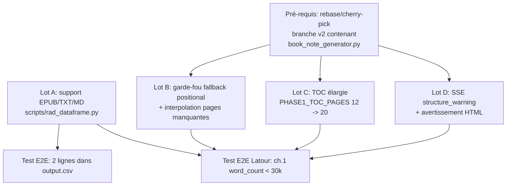

# Plan correctif — pipeline `[LIVRE]` + ingestion EPUB

## Contexte

Test résilience v2 sur deux livres :
- **Lahire (EPUB, 4.3 MB)** — *La Culture des individus*
- **Latour (PDF, 5.2 MB, ~504 p.)** — *Enquête sur les modes d'existence*

Constatations :
1. **Lahire EPUB** n'apparaît pas dans `output.csv` et ne déclenche aucune entrée dans `output_errors.json` → silencieusement filtré avant OCR.
2. **Latour** produit une fiche `[LIVRE]` mais le ch. 1 reçoit ~1.17 M chars (≈ 194 k mots) → un seul chapitre cumule plusieurs blocs concaténés. Smart-truncate écrête à 79 859 chars, mais le contenu envoyé au LLM Phase 2 mélange déjà plusieurs chapitres → fiche-chapitre trompeuse.
3. Phase 1 a renvoyé 8/12 chapitres avec `pages=(None, None)` → seuls 4/12 ont été re-slicés ; les 8 autres ont hérité du fallback positional `_merge_llm_structure` (copie de `initial.chapters[i].text`), d'où le débordement du ch. 1.
4. Pas d'événement SSE ni d'avertissement utilisateur sur cette dégradation.

## ⚠️ Pré-requis non vérifiable sur cette branche

Sur `claude/refine-local-plan-2crRG` (HEAD `5314030`), **aucun fichier `book_note_generator.py` n'existe** :

```
$ find /home/user/ragpy -name "book_note_generator*" → 0 résultat
$ git log --all --oneline | grep -i 'book\|livre' → 0 résultat
$ grep -rn 'PHASE1_TOC\|_merge_llm_structure\|_slice_pages_window\|SourceFormat' app/ scripts/ → 0 résultat
```

Les symboles ciblés par les Lots B / C / D (`_merge_llm_structure`, `_slice_pages_window`, `_extract_toc_excerpt`, `_assemble_book_html`, `build_book_note_async`, `PHASE1_TOC_PAGES`, `PHASE2_PAGE_MARGIN`, `THRESHOLD_MAX_CHAPTER_WORDS`, `SourceFormat`, `_normalize_pagination`) viennent d'un sprint v2 absent de la branche actuelle. **L'implémenteur doit d'abord rebaser/cherry-picker la branche v2** avant d'appliquer B/C/D — les line numbers de la draft (`~493-498`, `68`, `815-816`) ne sont pas opposables au tree courant.

Seul le **Lot A** (filtre `.pdf` dans `rad_dataframe.py`) est intégralement vérifiable et applicable tel quel sur cette branche.

## Diagnostic confirmé sur le tree courant

### Bug #1 — EPUB silencieusement filtré (CRITIQUE, vérifié)

Deux occurrences identiques du même filtre, toutes deux à corriger :

| Fonction | Fichier:ligne | Code |
|---|---|---|
| `_process_single_zotero_item` (chemin parallèle, en service) | `scripts/rad_dataframe.py:914` | `if not path_from_json or not path_from_json.lower().endswith(".pdf"): continue` |
| `load_zotero_to_dataframe` (legacy, non-incrémental) | `scripts/rad_dataframe.py:1294` | `if path_from_json and path_from_json.lower().endswith(".pdf"):` |

L'EPUB ne traverse aucun OCR et n'est pas non plus loggé dans `errors` → aucune trace.

### Bugs #2 / #3 / #4 — formulés contre du code v2 hors-tree

Les analyses de la draft (fallback positional `_merge_llm_structure`, fenêtre `PHASE1_TOC_PAGES=12`, log `Phase 0: %d/%d chapters re-sliced`) sont **plausibles techniquement** mais référencent des symboles inexistants dans `claude/refine-local-plan-2crRG`. À retravailler après merge de la branche v2.

## Shape du plan



Lot A est indépendant. B / C / D nécessitent que le code v2 soit présent ; ils peuvent ensuite être implémentés et committés séparément.

## Lot A — Support EPUB / TXT / MD (vérifié, applicable immédiatement)

### Fichiers à modifier

| Fichier | Changements |
|---|---|
| `scripts/rad_dataframe.py` | +~120 LOC (deux extracteurs, switch d'extension, errors loggés) |
| `scripts/requirements.txt` | +`ebooklib==0.18` (déjà présents : `beautifulsoup4==4.12.3`, `lxml==5.3.0`, `chardet==5.2.0`) |
| `app/utils/book_note_generator.py` | +`"epub"`, `"plain_text"` dans la liste des providers qui skippent le recodage GPT (à appliquer **uniquement après merge v2** — sinon hors-scope ce lot) |
| `tests/test_rad_dataframe_epub.py` | +60 LOC, nouveau fichier |

### Étapes d'implémentation

1. **Ajouter deux extracteurs** au-dessus de `_process_single_zotero_item` (~ligne 855), retournant un `OCRResult(text=..., provider=...)` pour homogénéité avec `extract_text_with_ocr_retry` :

   ```python
   def _extract_text_from_epub(epub_path: str) -> OCRResult:
       """Extract EPUB → text, preserving <a id="page_X"/> anchors as <!-- Page N --> markers."""
       from ebooklib import epub, ITEM_DOCUMENT
       from bs4 import BeautifulSoup
       book = epub.read_epub(epub_path)
       parts = []
       for item in book.get_items_of_type(ITEM_DOCUMENT):
           soup = BeautifulSoup(item.get_content(), "lxml")
           # Promote pagination anchors (epub:type="pagebreak" or id="page_N") to comments
           for anchor in soup.find_all(attrs={"epub:type": "pagebreak"}):
               anchor.replace_with(f"\n<!-- Page {anchor.get('title') or anchor.get('id', '?')} -->\n")
           for anchor in soup.find_all("a", id=lambda v: bool(v) and v.startswith("page")):
               anchor.replace_with(f"\n<!-- Page {anchor['id'].split('_', 1)[-1]} -->\n")
           parts.append(soup.get_text("\n", strip=True))
       text = "\n\n".join(p for p in parts if p)
       return OCRResult(text=text, provider="epub")

   def _extract_text_from_plain(path: str) -> OCRResult:
       with open(path, "r", encoding="utf-8", errors="replace") as f:
           return OCRResult(text=f.read(), provider="plain_text")
   ```

2. **Remplacer le filtre `.pdf`** à `rad_dataframe.py:914` par un switch :

   ```python
   ext = os.path.splitext(path_from_json)[1].lower()
   if ext == ".pdf":
       ocr_payload = extract_text_with_ocr_retry(actual_pdf_path, return_details=True)
   elif ext == ".epub":
       ocr_payload = _extract_text_from_epub(actual_pdf_path)
   elif ext in (".txt", ".md"):
       ocr_payload = _extract_text_from_plain(actual_pdf_path)
   else:
       errors.append({
           "itemKey": item_key,
           "title": metadata.get("title", ""),
           "error_type": "UNSUPPORTED_EXTENSION",
           "error_message": f"Extension non supportée: {ext or '(none)'}",
           "path": path_from_json,
           "timestamp": time.strftime("%Y-%m-%d %H:%M:%S"),
       })
       continue
   ```

   Couper la résolution + fuzzy-search (lignes 917-935) **avant** ce switch (résolution de chemin reste la même, le fuzzy-search PDF actuel reste valide pour `.pdf` ; pour les autres extensions on utilise le chemin résolu tel quel sans fuzzy puisque les noms d'attachements EPUB sont rarement modifiés).

3. **Répliquer le même switch** dans `load_zotero_to_dataframe` à `rad_dataframe.py:1294` (chemin legacy ; même logique mais sans `errors` puisque cette fonction ne maintient pas la liste — ajouter au minimum un `logger.warning` explicite).

4. **Ne PAS toucher** à `extract_pdf_metadata_to_dataframe` (`rad_dataframe.py:1340-…`) qui scanne un répertoire de PDFs uniquement — hors-scope.

### Notes d'implémentation

- `OCRResult` est défini à `rad_dataframe.py:467` (`NamedTuple(text, provider)`) — réutiliser tel quel.
- Le record final (`rad_dataframe.py:947-955`) consomme déjà `ocr_payload.text` / `ocr_payload.provider` → aucune modification du schéma CSV.
- `OCRExtractionError` (ligne 463) ne s'applique pas aux extracteurs EPUB/plain ; en cas d'échec lever directement et capturer dans `try/except Exception` du chemin parallèle existant (lignes 958-967) — refactorer le `except OCRExtractionError` en `except (OCRExtractionError, Exception)` au-dessus du record.
- Variables `ebooklib==0.18` : pure-Python, pas de build natif, compatible avec `python:3.11-slim` du `Dockerfile`. Ajouter avant `lxml==5.3.0` dans `scripts/requirements.txt`.

## Lots B / C / D — à appliquer après cherry-pick de la branche v2

Une fois `book_note_generator.py` présent dans le tree, les correctifs proposés dans la draft restent pertinents. Vérifier avant édition :
- Que `_merge_llm_structure` (ou son équivalent) existe et que la signature des `chapters` expose bien `pages: tuple[int|None, int|None]` et `text: str`.
- Que `PHASE1_TOC_PAGES` est exporté en module-level.
- Que `build_book_note_async` accepte bien un `progress_cb` async.

Les seuils proposés dans la draft (`2 × THRESHOLD_MAX_CHAPTER_WORDS = 60 000` mots, `coverage < 0.8`, `PHASE1_TOC_PAGES = 20`, fenêtre 8 000 chars autour de l'ancre TOC) sont raisonnables et n'ont pas besoin de changer ; les conserver.

Un détail à figer en plus de la draft : **l'interpolation des pages manquantes** (Lot B point 2) doit s'appuyer sur le `max_page` connu via les `<!-- Page N -->` markers (Latour : ~504 ; Lahire post-Lot A : selon ancres EPUB). Source de vérité unique : un helper `_max_page_from_markers(full_text) -> int` à co-localiser dans `book_note_generator.py`.

## Tests

### Lot A (immédiat)

Créer `tests/test_rad_dataframe_epub.py` :

```python
import os, tempfile, json
from ebooklib import epub
from scripts.rad_dataframe import _extract_text_from_epub, _process_single_zotero_item

def test_extract_text_from_epub_preserves_pagination(tmp_path):
    book = epub.EpubBook()
    book.set_identifier("t"); book.set_title("Test"); book.set_language("fr")
    c = epub.EpubHtml(title="Ch1", file_name="c1.xhtml", lang="fr")
    c.content = b'<html><body><a id="page_1"/>Hello<a id="page_2"/>World</body></html>'
    book.add_item(c); book.spine = [c]
    p = tmp_path / "x.epub"
    epub.write_epub(str(p), book)
    out = _extract_text_from_epub(str(p))
    assert "<!-- Page 1 -->" in out.text
    assert "<!-- Page 2 -->" in out.text
    assert out.provider == "epub"

def test_unsupported_extension_logs_error(tmp_path):
    item = {
        "key": "ABC",
        "title": "Test",
        "attachments": [{"path": str(tmp_path / "f.docx"), "title": "DOCX"}],
        "creators": [],
    }
    (tmp_path / "f.docx").write_text("fake")
    res = _process_single_zotero_item(item, str(tmp_path))
    assert any(e["error_type"] == "UNSUPPORTED_EXTENSION" for e in res.errors)
    assert res.records == []
```

### Lots B / D (post-merge v2)

Conformes à la draft :
- `test_merge_llm_structure_caps_oversized_fallback`
- `test_merge_llm_structure_interpolates_missing_pages`
- `test_assembly_warns_on_low_coverage`

## Vérification end-to-end

```bash
# 1. Tests unitaires Lot A (cette branche)
docker compose exec ragpy pytest tests/test_rad_dataframe_epub.py -v

# 2. Tests unitaires Lots B/D (après merge v2)
docker compose exec ragpy pytest tests/test_book_note_generator_v2.py -v

# 3. E2E session f18dc372_Archive
#    a) Réuploader le ZIP avec EPUB Lahire + PDF Latour
#    b) Vérifier output.csv -> 2 lignes, providers ∈ {epub, mistral}
#    c) Vérifier output_errors.json -> 0 entrée UNSUPPORTED_EXTENSION
#    d) Lancer la génération [LIVRE]
#    e) generated_notes.json contient 2 fiches
#    f) Latour : word_count(ch.1) < 30_000 dans le HTML rendu
#    g) Lahire : ≥ 8 chapitres, marqueurs <!-- Page N --> préservés en amont du chunking

# 4. Logs
docker compose logs ragpy --since 30m | \
  grep -E 'epub|UNSUPPORTED|Phase 0|Phase 1|coverage|interpolat'
```

## Hors-scope (backlog)

- Estimation pré-Phase 2 du coût LLM (écart sprint v2).
- Vérification context-window proactive (écart sprint v2).
- OCR Mistral par paragraphe pour PDF scannés dégradés.
- Support `.azw3`, `.mobi`, `.djvu` (à l'avenir).

## Ordre recommandé

1. **Lot A** sur `claude/refine-local-plan-2crRG` → commit + push.
2. Cherry-pick / merge de la branche v2 (`book_note_generator.py` + tests v2 existants).
3. **Lot B** (garde-fou + interpolation) → commit.
4. **Lot C** (`PHASE1_TOC_PAGES = 20` + extraction TOC élargie) → commit.
5. **Lot D** (SSE + warning HTML) → commit.
6. PR unique ou stack de PRs selon préférence reviewer.